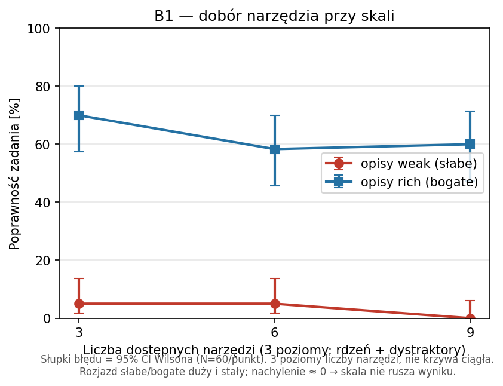
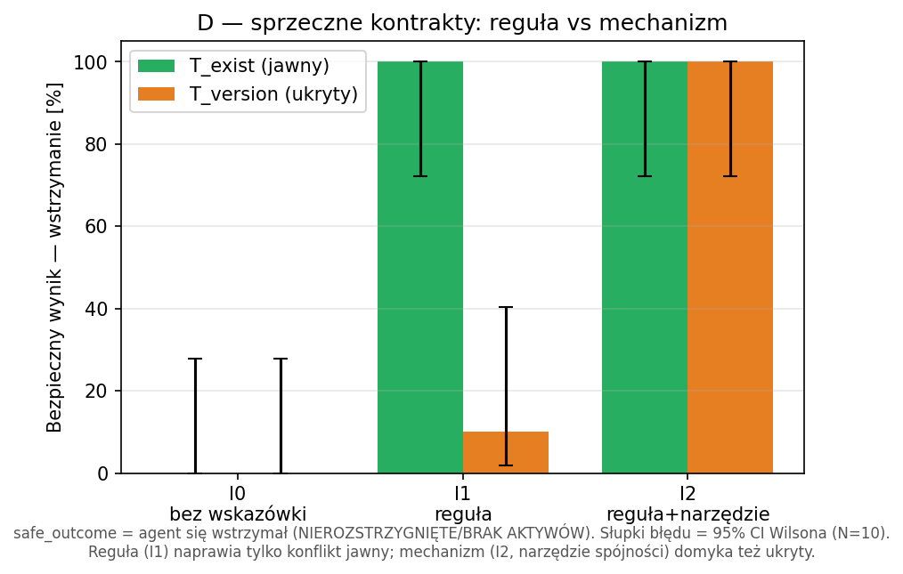

# Badanie możliwości wykonywania złożonych zadań z wykorzystaniem agentów AI i protokołu MCP — raport

## Streszczenie

Badanie mierzy, **co protokół MCP wnosi do agenta LLM** w wieloetapowym zadaniu korelacji i **gdzie mieszka ta wartość**. Na deterministycznym stanowisku (agent korelacji podatności, 3 serwisy MCP), z prawdziwym warunkiem kontrolnym bez MCP, N=10 powtórzeniami, przedziałami ufności i testami istotności, pokazujemy że: (1) MCP jest **warstwą transportu** — nie zmienia poprawności ani kosztu; (2) **lokalizacja wiedzy decyzyjnej jest neutralna** — ta sama macierz reguł działa równie dobrze w schemacie narzędzia, co w prompcie (liczy się obecność, nie miejsce); (3) dobór narzędzi jest **odporny na dystraktory**, a o jakości decyduje kontrakt, nie skala; (4) **granicą zdolności jest spójność kontraktów** — sprzeczne źródła prowadzą agenta do pewnych, błędnych werdyktów (w tym fałszywych negatywów), czego reguła w prompcie nie naprawia dla konfliktu ukrytego — domyka go dopiero mechanizm (narzędzie spójności w warstwie MCP).

## Wkład

- **Metodyka izolująca warstwę MCP:** wspólne `tool_logic` dla serwisów MCP i narzędzi in-process daje czysty baseline „MCP vs nie-MCP" (A1).
- **Czysty test lokalizacji wiedzy** (treść stała, miejsce zmienne): schemat MCP jest równoważnym i przenośnym nośnikiem wiedzy decyzyjnej co prompt (A3) — koryguje pozorną przewagę promptu z A2.
- **Pomiar doboru narzędzi przy skali z dystraktorami:** jakość kontraktu dominuje nad liczbą narzędzi; brak ulegania dystraktorom (B1).
- **Charakterystyka granicy spójności kontraktów** i pełna ścieżka naprawy I0→I1→I2: reguła naprawia tylko konflikt jawny, mechanizm domyka ukryty; sygnalizacja ryzyka fałszywych negatywów dla bezpieczeństwa (D).
- **Odtwarzalny, config-driven harness** z surowymi danymi per bieg (JSONL) i skryptami rysunków.

## Czym jest „złożone zadanie" w tym badaniu

Zadanie agenta nie jest pojedynczym look-upem, lecz **korelacją** o czterech osiach złożoności:

- **głębokość łańcucha** — wyjście jednego narzędzia jest parametrem kolejnego (np. `project_id` z kroku 2 → krok 3),
- **liczba bytów do skorelowania** — wiele projektów / bibliotek / CVE naraz,
- **spójność kontraktów** — czy źródła zgadzają się co do istnienia/stanu zasobu,
- **potrzeba wstrzymania się (abstinence)** — rozpoznanie „BRAK AKTYWÓW" zamiast zgadywania.

Domeną testową jest agent korelacji podatności bezpieczeństwa; dane są deterministycznymi stubami, więc poprawna odpowiedź jest znana z góry.

## Pytania badawcze

- **RQ1 (mechanizm i lokalizacja wartości).** Czy warstwa MCP zmienia zachowanie agenta ponad to, co wynika z samej informacji docierającej do modelu — a jeśli wnosi wartość, to gdzie ona mieszka: w schemacie narzędzia czy w prompcie?
- **RQ2 (granica zdolności przy złożoności i skali).** Jak wraz ze wzrostem liczby dostępnych narzędzi i złożoności zadania zmienia się zdolność agenta do poprawnej korelacji — i które właściwości projektu MCP przesuwają tę granicę?

## Metodologia (skrót)

Agent korelacji (smolagents `ToolCallingAgent`) z trzema źródłami: `get_vulnerability`, `get_projects_using_library`, `get_project_details`. Logika i opisy narzędzi są wspólne (`tool_logic.py`) dla dwóch warstw dostarczania — serwisów MCP (FastMCP, stdio) i narzędzi in-process — dzięki czemu porównanie „MCP vs nie-MCP" izoluje **wyłącznie warstwę transportu**.

- **Model główny:** gpt-4.1-mini. **Model duży (kluczowe komórki):** gpt-5.2.
- **Powtórzenia:** N=10 na warunek × 6 scenariuszy = 60 biegów/warunek.
- **Metryki:** poprawność STATUS i PRIORYTET (raportowane **osobno** oraz jako łączny `pass`), precyzja/recall wyboru narzędzi, kompletność wywołań, false-positive, tokeny, latencja.
- **Statystyka:** rate ± przedział ufności Wilsona 95%; porównania testem dwóch proporcji (z).
- **Temperatura:** nieustawiana — model pracuje na domyślnej temperaturze dostawcy (≈1.0). Stuby są deterministyczne, więc **cała wariancja między powtórzeniami pochodzi ze stochastyczności próbkowania modelu**, nie z danych. Przedziały ufności należy czytać jako niepewność wynikającą z samplingu.
- **Korekta wielokrotnych porównań:** raportujemy surowe p. Wyniki nagłówkowe (p<0.001) przeżywają korektę Holma–Bonferroniego; wyniki graniczne (np. B1 weak 3→9, p=0.079) należy traktować jako sugestywne, nie rozstrzygające.

Konfiguracja w pełni odtwarzalna (config-driven, surowe wyniki JSONL per bieg).

---

## Część A — wartość MCP i lokalizacja wiedzy

### A1 — efekt samego transportu

Ta sama informacja (słaby opis + pełne reguły w prompcie), zmienia się tylko sposób dostarczenia narzędzi.

| Warunek | pass-rate | 95% CI | śr. tokeny in | mediana latencji |
|---|---|---|---|---|
| `noMCP` (in-process) | 100.0% | [94.0, 100] | 6144 | 5.7 s |
| `MCP` (stdio) | 100.0% | [94.0, 100] | 6068 | 4.9 s |

Test dwóch proporcji: **z = 0.00, p = 1.000**. Narzut tokenów znikomy, mediana latencji ~5 s w obu.

> **Uczciwe sformułowanie A1.** To w dużej mierze **kontrola architektoniczna, nie odkrycie o MCP**: obie ścieżki budują ten sam `ToolCallingAgent` i podają modelowi **bajtowo identyczne definicje narzędzi** — ścieżka MCP jedynie pobiera ten sam schemat przez stdio. Framework normalizuje oba warianty do tej samej reprezentacji w prompcie, więc identyczny wynik jest *oczekiwany*. Wartość A1 polega na **wykluczeniu ukrytego narzutu transportu** (tokeny, latencja), a nie na wykazaniu, że „MCP nie zmienia rozumowania" — to drugie wynika z architektury.
>
> **Drobna asymetria:** `structured_output=True` jest ustawiane tylko na ścieżce MCP. Nie wpłynęło na poprawność (100%=100%), ale może lekko różnicować parsing/tokeny — do wyrównania w kolejnej iteracji.

### A2 — gdzie mieszka wiedza (2×2) i co naprawdę mierzy `pass`

| | prompt: minimalny | prompt: pełne reguły |
|---|---|---|
| **schemat: słaby** | 50.0% (CI 37.7–62.3) | 100.0% (CI 94–100) |
| **schemat: bogaty** | 60.0% (CI 47.4–71.4) | 100.0% (CI 94–100) |

Na pierwszy rzut oka: reguły w prompcie dają +50 pp (p<0.001), a jakość schematu jedynie +10 pp (p=0.27, nieistotne). **Ale to mylące** — rozbicie `pass` na składowe ujawnia mechanizm:

| Warunek | pass | **status_ok** | **priority_ok** | recall wywołań | false-positive |
|---|---|---|---|---|---|
| weak_min | 50% | **100%** | 50% | 0.68 | 5.0% |
| rich_min | 60% | **100%** | 60% | 0.89 | **0.0%** |
| weak_full | 100% | 100% | 100% | 0.93 | 16.7% |
| rich_full | 100% | 100% | 100% | 0.89 | 15.0% |

**STATUS jest poprawny w 100% we wszystkich czterech komórkach.** Cały sygnał `pass` w A2 to wyłącznie PRIORYTET. To zmienia interpretację:

- **Wiedza proceduralna/statusowa** (jak wywołać, co z czym porównać) wystarcza, by STATUS był idealny — i niesie ją nawet słaby schemat. Bogaty schemat dodatkowo poprawia *kompletność zbierania* (recall 0.68→0.89) i znosi false-positive (5%→0%).
- **PRIORYTET** wymaga macierzy decyzyjnej (CVSS × środowisko → etykieta). Ta macierz w siatce A2 istniała **wyłącznie w prompcie** (`TASK_FULL`); bogaty schemat zawierał miękkie podpowiedzi („staging = okno planowane"), ale **nie samą macierz**.

Stąd „+50 pp reguł vs +10 pp schematu" **myli lokalizację wiedzy z jej treścią**: schemat fizycznie nie mógł wyprodukować etykiety, bo macierzy w nim nie było. Czysty test lokalizacji (A3) trzyma treść stałą i rozstrzyga sprawę.

### A3 — czysty test lokalizacji wiedzy (rozstrzyga A2) — **wynik kluczowy**

Ta sama macierz decyzyjna (`DECISION_RULES`, jedno źródło prawdy) umieszczona raz w prompcie, raz w **schemacie** narzędzia (opis `get_project_details`), raz w obu, raz nigdzie. Treść identyczna — zmienia się tylko miejsce.

| Macierz w… | pass | 95% CI | status_ok | priority_ok |
|---|---|---|---|---|
| nigdzie (`loc_none`) | 60% | [47, 71] | 98% | 62% |
| prompcie (`loc_prompt`) | 100% | [94, 100] | 100% | 100% |
| **SCHEMACIE (`loc_schema`)** | **100%** | [94, 100] | 100% | **100%** |
| obu (`loc_both`) | 100% | [94, 100] | 100% | 100% |

Test dwóch proporcji **prompt vs schemat: z = 0.00, p = 1.000** — żadnej różnicy. W `loc_schema` priorytet jest poprawny na **wszystkich 6 scenariuszach** (w tym staging i BRAK AKTYWÓW).

**Wniosek (częściowo obala obraz z A2):** **lokalizacja wiedzy decyzyjnej jest neutralna** — ta sama macierz działa tak samo dobrze w schemacie MCP, co w prompcie. Liczy się **obecność** wiedzy, nie jej miejsce. Asymetria z A2 była artefaktem tego, że macierz testowano tylko w jednym miejscu. To **wzmacnia** tezę o kontrakcie MCP jako nośniku wiedzy: schemat jest pełnoprawnym domem także dla reguł decyzyjnych — z praktyczną przewagą, że wiedza wędruje z narzędziem (przeżywa zmiany promptu i refaktor agenta).

### A4 — odporność na perturbacje promptu

Prefiksy `persona` / `paraphrase` doklejane do zadania nie psują wyniku ani w `rich_min` (60% → 58/53%), ani w `weak_full` (100% → 100%). To pokazuje odporność na styl, **ale nie testuje przenośności** — warianty nie usuwały reguł. Czystą dysocjację lokalizacji daje dopiero A3 (powyżej), który tę lukę domyka.

### Model vs konfiguracja (H-MODEL)

| Warunek | gpt-4.1-mini | gpt-5.2 | z | p |
|---|---|---|---|---|
| rich_full | 100% | 98.3% | +1.00 | 0.315 |
| weak_full | 100% | 100% | 0.00 | 1.000 |
| mcp_equiv (weak+full) | 100% | 100% | 0.00 | 1.000 |

**W konfiguracjach już nasyconych (100% dla obu modeli) gpt-5.2 nie dokłada nic** — co przy **efekcie sufitowym** jest oczekiwane: brak zapasu, w którym większy model mógłby pokazać przewagę. To **nie jest test przewagi modelu w ogóle**, lecz potwierdzenie, że na łatwych/nasyconych warunkach większy model nie szkodzi (jest za to wolniejszy i droższy). Przewagi na komórkach z zapasem (weak_min, b1_weak, hard_conflict/`T_version`) nie sprawdzano — pozostaje otwarte.

---

## Część B — złożoność i skala

### B1 — wybór narzędzia przy skali (dystraktory)

Zadanie w trybie `goal`. Liczba dostępnych narzędzi: 3 → 6 → 9 (rdzeń + dystraktory).

| Liczba narzędzi | opisy słabe | opisy bogate |
|---|---|---|
| 3 (core) | 5.0% | 70.0% |
| 6 (plus3) | 5.0% | 58.3% |
| 9 (plus6) | 0.0% | 60.0% |

1. **Dominuje jakość opisów, nie liczba narzędzi.** Rich ~60–70% niezależnie od skali; weak ~0–5%. Różnica skali 3→9 nieistotna (rich p=0.25; weak p=0.079, graniczny).
2. **Agent nie daje się zwieść dystraktorom.** Precyzja wyboru = **1.00** we wszystkich warunkach — nawet przy 9 narzędziach nie wywołuje nierelewantnych serwisów. Tryb porażki to **niekompletność** przy słabych opisach (recall ~0.68), nie błędny wybór.
3. **Skala ma koszt tokenowy** (rich: 6659 → 7920 → 9348 tokenów wejścia).

> Uwaga: niskie `pass` przy słabych opisach to znów głównie priorytet (status_ok≈100%, jak w A2) — B1 mierzy ten sam mechanizm pod inną osią.

### B2 — trudne scenariusze (wieloetapowość)

| Warunek | pass-rate | 95% CI |
|---|---|---|
| rich + pełne reguły | 85.0% | [73.9, 91.9] |
| weak + trigger | 50.0% | [37.7, 62.3] |

Rozkład **per scenariusz** (rich+full) — agregat 85% uśrednia heterogeniczne reżimy trudności:

| Scenariusz | pass |
|---|---|
| hard_fleet (5 projektów) · hard_multi_lib · hard_multi_cve · hard_decoy · hard_boundary | 10/10 każdy |
| **hard_conflict (sprzeczne kontrakty)** | **1/10** |

**Cały spadek pochodzi z jednego scenariusza.** Pięć z sześciu trudnych przypadków rozwiązanych bezbłędnie; agregat 85% to artefakt poolingu — to `hard_conflict` ciągnie wynik w dół (dlatego raportujemy per-scenariusz, nie tylko średnią).

> **Uwaga o CI agregatu.** Rozkład wyników B2 jest **dwumodalny** (5 scenariuszy ≈100%, 1 scenariusz ≈10%), nie dwumianowy. Przedział Wilsona [73.9, 91.9] dla 85% zakłada **jednorodność** scenariuszy, której tu nie ma — jest więc formalnie nieuprawniony i podany wyłącznie poglądowo. Wiążący jest rozkład per-scenariusz powyżej, nie pooled CI.

> **Ograniczenie metryki false-positive.** Surowy fp-rate (32%) jest **zawyżony**: `hard_boundary` daje fp=9/10 przy pass=10/10, bo agent poprawnie *omawia* bezpieczny projekt, a metryka (podłańcuch `project_id`) liczy każdą wzmiankę jako oznaczenie. Realne nad-oznaczanie jest tylko w `hard_fleet`. Potrzebne strukturalne parsowanie listy projektów.

---

## Część D — zachowanie przy sprzecznych kontraktach (pogłębienie `hard_conflict`)

`hard_conflict` był w Części B jedyną systematyczną porażką (1/10), więc zbadaliśmy go osobno: **2 typy sprzeczności × 3 interwencje**, N=10.

- **Typ konfliktu** (scenariusz): `T_exist` — skład zgłasza projekt, inwentarz go nie zna (sygnał **jawny**, 404); `T_version` — skład: 3.1.4 (podatna), inwentarz: 3.2.1 (bezpieczna) dla tego samego projektu (sygnał **ukryty**, wygląda jak zwykłe dane).
- **Interwencja** (zadanie): `I0` — bez wskazówki; `I1` — jawna reguła „przy sprzeczności nie zgaduj → NIEROZSTRZYGNIĘTE"; `I2` — ta sama reguła + dostępne i zalecone **narzędzie `check_consistency`** (mechanizm detekcji wyniesiony do kontraktu MCP).

| Interwencja | Typ | safe_outcome | conflict_detected | hallucinated | użył `check_consistency` |
|---|---|---|---|---|---|
| I0 (bez wskazówki) | T_exist (jawny) | 0% | 0% | 100% | — |
| I0 | T_version (ukryty) | 0% | 10% | 100% | — |
| I1 (reguła) | T_exist | 100% | 100% | 0% | — |
| I1 | T_version | 10% | 40% | 90% | — |
| **I2 (reguła+narzędzie)** | **T_exist** | **100%** | 100% | 0% | 70% |
| **I2** | **T_version** | **100%** | 100% | 0% | 100% |

Testy **dokładne Fishera (two-sided)** na safe_outcome (n=10/komórkę): I0→I1 dla `T_exist` **p≈1.1×10⁻⁵** (różnica +100 pp, 95% CI Newcombe [61, 100]); dla `T_version` **p≈1.0 (nieistotnie)**; **I1→I2 dla `T_version` p≈1.2×10⁻⁴** (różnica +90 pp, 95% CI Newcombe [49, 98]). Przy n=10 i wartościach przy brzegu 0/1 aproksymacja normalna (z-test dwóch proporcji) łamie warunek Walda (np≥5) i jest nieadekwatna — stąd test dokładny i CI metodą Newcombe'a zamiast pojedynczego p.

1. **Baseline (I0) konfabuluje w 100%** — zawsze pewny werdykt, zero wstrzymań, na obu typach. Kierunek zgadywania zależy od **zakotwiczenia źródła**: `T_exist` → NARAŻONY, `T_version` → **NIE NARAŻONY**. To drugie to **fałszywy negatyw** — agent przeoczyłby realną podatność, gdyby rację miał serwis składu. Czyli wcześniejsze „zgaduje na korzyść narażenia" było uproszczeniem; przy ukrytym konflikcie zgaduje w stronę *niebezpieczną*.
2. **Jawna reguła (I1) naprawia konflikt JAWNY, ale nie UKRYTY.** `T_exist`: 0%→100% (404 to czytelny sygnał). `T_version`: 0%→10% (nieistotnie). Wąskim gardłem jest **DETEKCJA, nie polityka**: dla I1/`T_version` detekcja 40% > wstrzymanie 10% — nawet gdy agent *wspomni* o rozbieżności, w ~30% i tak commituje werdykt.
3. **Mechanizm (I2) domyka problem, którego reguła nie ruszyła.** Dodanie narzędzia `check_consistency` podnosi `T_version` z 10% do **100% bezpiecznych wyników** (p<0.001), detekcja 100%, halucynacja 0%. Agent wywołał narzędzie w **100%** biegów ukrytego konfliktu (i tylko 70% przy jawnym — przy 404 sygnał jest już oczywisty bez narzędzia). Mechanizm **przenosi detekcję z zawodnego rozumowania modelu do kontraktu**.

**Kontrybucja (empirycznie domknięta przez I0→I1→I2):** spójności kontraktów MCP **nie da się załatać regułą w prompcie**, gdy sprzeczność nie jest jawnym sygnałem (I1/`T_version` = 10%) — to defekt na poziomie kontraktu, nie braku instrukcji. Natomiast **mechanizm** — dedykowane narzędzie spójności w warstwie MCP — rozwiązuje go w pełni (I2/`T_version` = 100%, p<0.001), bo przenosi detekcję z zawodnego rozumowania modelu do kontraktu. Rekomendacja inżynierska: **spójność wymuszaj mechanizmem (walidacja/narzędzie w kontrakcie), nie regułą w prompcie.** Implikacja bezpieczeństwa: nieobsłużony ukryty konflikt prowadzi do **fałszywych negatywów** (przeoczenie podatności), nie tylko do nadmiernego alarmu.

---

## Zagrożenia trafności

- **Trafność konstruktu.** `pass` (binarne STATUS+PRIORYTET) ukrywa mechanizm — rozbicie na status_ok/priority_ok (A2, A3) pokazuje, że to priorytet niesie sygnał. Metryka FP oparta na podłańcuchu jest tępa (zawyża B2). „Złożoność" operacjonalizowano jako szerokość (dystraktory) + trudność scenariuszy; **głębokość łańcucha** (5–6 hopów, rozgałęzienia, błędy narzędzi) nie była wariowana. **Pooled CI dla N=60 (=6 scenariuszy × 10)** zakłada homogeniczność scenariuszy; tam, gdzie rozkład per-scenariusz jest dwumodalny (np. B2), pooled CI należy czytać poglądowo, a wiążący jest rozkład per-scenariusz.
- **Trafność wewnętrzna.** Wariancja pochodzi z samplingu (temp≈1.0) na deterministycznych stubach. A1 jest częściowo kontrolą architektoniczną (framework normalizuje definicje narzędzi). Asymetria `structured_output` (tylko MCP). Pojedynczy outlier latencji (zimny start) — raportujemy mediany. Brak formalnej korekty wielokrotnych porównań (nagłówki ją przeżywają).
- **Trafność zewnętrzna.** Jedna domena, jeden framework (smolagents `ToolCallingAgent`), jedna rodzina modeli (OpenAI). Wnioski należy traktować jako mocne *w tym reżimie*; uogólnienie na inne domeny/frameworki/modele pozostaje do zweryfikowania (patrz dalsze kroki).

---

## Wnioski

### RQ1 — mechanizm i lokalizacja wartości

1. **MCP jest warstwą transportu.** Przy identycznej informacji noMCP i MCP dają identyczną poprawność (p=1.0) i znikomy narzut tokenów/latencji — przy czym jest to w dużej mierze konsekwencja architektury frameworka (kontrola, nie odkrycie).
2. **Lokalizacja wiedzy decyzyjnej jest neutralna (A3).** Ta sama macierz CVSSלrodowisko daje 100% poprawności zarówno z promptu, jak i ze schematu MCP (p=1.0). **Liczy się obecność wiedzy, nie jej miejsce.** Pozorna przewaga promptu z A2 (+50 pp) była confoundem treści — bogaty schemat nigdy nie zawierał macierzy.
3. **Mechanizm (rozbicie status/priority).** Wiedza proceduralna/statusowa rozwiązuje STATUS w 100% nawet przy słabym schemacie; wiedza decyzyjna (macierz→etykieta) jest konieczna dla PRIORYTETU i działa z dowolnego z dwóch miejsc. Bogaty schemat dodatkowo poprawia kompletność zbierania i znosi false-positive.
4. **Konsekwencja dla wartości MCP.** Schemat MCP jest **pełnoprawnym i przenośnym nośnikiem** wiedzy — także decyzyjnej. To jego realna przewaga nad regułami w prompcie: wiedza podróżuje z narzędziem, przeżywając zmiany promptu, modelu i refaktor agenta.

### RQ2 — granica zdolności przy złożoności i skali

1. **Jakość kontraktu dominuje nad skalą.** Do 9 narzędzi liczba dystraktorów nie obniża istotnie wyniku; discovery MCP jest odporne na dystraktory (precyzja 1.00). Tryb porażki to niekompletność przy słabych opisach, nie błędny wybór. Skala ma realny koszt tokenowy.
2. **Granica zdolności to spójność kontraktów, nie złożoność per se** (Część D). Pięć z sześciu trudnych scenariuszy rozwiązanych bezbłędnie; jedyny systematyczny upadek to **sprzeczność między serwisami**. Pełna ścieżka naprawy: jawna reguła w prompcie naprawia konflikt **jawny** (404: 0→100%), ale **nie ukryty** (wersje: 0→10%, nieistotnie) — bo wąskim gardłem jest **detekcja**, nie polityka. Dopiero **mechanizm** (narzędzie spójności w kontrakcie MCP) domyka ukryty konflikt (10→100%, p<0.001). Wniosek: spójność wymuszaj mechanizmem, nie promptem; nieobsłużony ukryty konflikt → **fałszywe negatywy** (przeoczenie podatności).
3. **Pojemność modelu nie jest wąskim gardłem w warunkach nasyconych** — przy właściwej konfiguracji (komórki na 100%) gpt-5.2 nie poprawia wyników względem gpt-4.1-mini. Zastrzeżenie: porównania nie prowadzono na warunkach z zapasem, więc to **nie** jest twierdzenie o braku przewagi modelu w ogóle (efekt sufitowy).

## Załącznik — pełne tabele zbiorcze

### Część A/B (sweep, N=10)

| Warunek | n | pass | 95% CI | FP | śr. tokeny in | śr. latencja [s] |
|---|---|---|---|---|---|---|
| a1_nomcp | 60 | 1.00 | [0.94,1.00] | 0.15 | 6144 | 185.85* |
| a1_mcp_equiv | 60 | 1.00 | [0.94,1.00] | 0.17 | 6068 | 5.07 |
| a1_mcp_equiv__large | 60 | 1.00 | [0.94,1.00] | 0.17 | 6431 | 8.10 |
| a2_weak_min | 60 | 0.50 | [0.38,0.62] | 0.05 | 3982 | 2.53 |
| a2_rich_min | 60 | 0.60 | [0.47,0.71] | 0.00 | 6133 | 3.07 |
| a2_weak_full | 60 | 1.00 | [0.94,1.00] | 0.17 | 6040 | 5.06 |
| a2_rich_full | 60 | 1.00 | [0.94,1.00] | 0.15 | 7018 | 5.16 |
| a2_rich_full__large | 60 | 0.98 | [0.91,1.00] | 0.17 | 7666 | 8.18 |
| a2_weak_full__large | 60 | 1.00 | [0.94,1.00] | 0.17 | 6430 | 113.26* |
| a2_rich_min__persona | 60 | 0.58 | [0.46,0.70] | 0.00 | 6233 | 3.43 |
| a2_rich_min__paraphrase | 60 | 0.53 | [0.41,0.65] | 0.05 | 6211 | 3.63 |
| a2_weak_full__persona | 60 | 1.00 | [0.94,1.00] | 0.17 | 6172 | 5.52 |
| a2_weak_full__paraphrase | 60 | 1.00 | [0.94,1.00] | 0.17 | 6148 | 5.29 |
| b1_core_weak | 60 | 0.05 | [0.02,0.14] | 0.00 | 2874 | 3.50 |
| b1_core_rich | 60 | 0.70 | [0.57,0.80] | 0.17 | 6659 | 4.70 |
| b1_plus3_weak | 60 | 0.05 | [0.02,0.14] | 0.02 | 3429 | 4.65 |
| b1_plus3_rich | 60 | 0.58 | [0.46,0.70] | 0.17 | 7920 | 5.68 |
| b1_plus6_weak | 60 | 0.00 | [0.00,0.06] | 0.00 | 3592 | 4.33 |
| b1_plus6_rich | 60 | 0.60 | [0.47,0.71] | 0.17 | 9348 | 5.39 |
| b2_hard_rich_full | 60 | 0.85 | [0.74,0.92] | 0.32** | 7352 | 51.64 |
| b2_hard_weak_trig | 60 | 0.50 | [0.38,0.62] | 0.10 | 4019 | 2.98 |

### A3 — test lokalizacji wiedzy (N=10; w kodzie: PART_C)

| Warunek | macierz w… | n | pass | 95% CI | status_ok | priority_ok |
|---|---|---|---|---|---|---|
| loc_none | nigdzie | 60 | 0.60 | [0.47,0.71] | 0.98 | 0.62 |
| loc_prompt | prompcie | 60 | 1.00 | [0.94,1.00] | 1.00 | 1.00 |
| loc_schema | schemacie | 60 | 1.00 | [0.94,1.00] | 1.00 | 1.00 |
| loc_both | obu | 60 | 1.00 | [0.94,1.00] | 1.00 | 1.00 |

\* średnia zniekształcona przez obserwacje odstające (zimny start / model rozumujący); mediany ~5 s.
\*\* zawyżone przez tępą metrykę podłańcucha; patrz ograniczenie B2.
